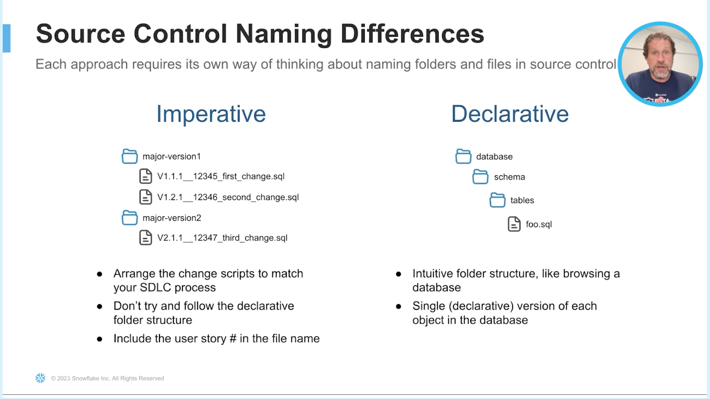

# Database Change Management (DCM) via Schemachange

## Declartive vs. Imperative Programming
**Declartive** programming _declares_ what the state of the database should be. It does not care about the current state. It simply focuses on getting the database to the declared state. 

Terraform is a declarative DCM tool.

**Imperative** programming requires the author to be aware of how the database is currently configured. The author must write the code that gets the database from the current state to the new state.

Schemachange is an imperative DCM tool.

## Reasoning
Schemachange was selected over other DCM tools because there is no additional learning curve. You write SQL. 
Also there is no extra infrastructure needed to manage the state. No extra cloud service. No provisioning a separate database for tracking the state.

## Resources
[Schemachange Docs](https://github.com/Snowflake-Labs/schemachange)

## Considerations
Snowflake is rolling out native declartative functionality with their `create or alter` statements. This is limited to Tables and Views at the end of 2023, but is something to monitor.